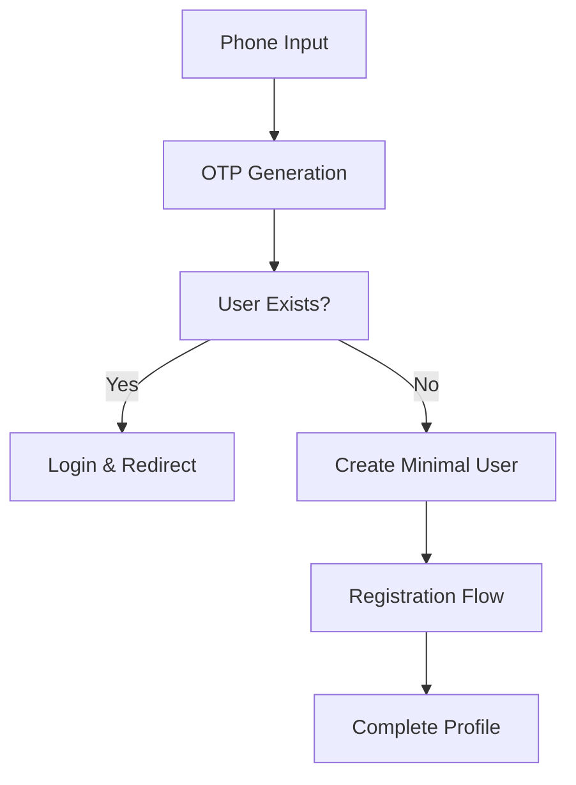

prompt:
let's talk about auth for this project:

ok, let me tell you exactly how i want the auth flow for this project:

1. i want a single form for both login/signup, like in frontend we have the same login/signup modal than opens with a button click(or any trigger), user enters the number and requests otp, otp is generated and sent to user, if user is new he's taken to next register form(as well as logged in) where he enters more details else if he's an existing user he's logged in and redirected to dashboard(or back to whereever he triggered the login).

2. for an existing user we also send pertinent info to frontend so they can redirect accordingly. for instance: user type: lawyers are redirected to a lawyer dashboard whereas normal user(client by default) are taken back to where they triggered login.

3. for any user we also recieve user type from the frontend(if not, user type should be client by default) along with phone number to trigger the otp. if user is new we create a new user with just phone number and a user type and update other details later on via different requests(for instance right now we have a post request endpoint to create a new lawyer, but after auth application, we don't create a new user entry here, we just update the respective data, users are strictly created during the otp auth, maybe with a registration pending field and some default values for relevant fields like name as "new user", or something, whatever and whichever fields you think would benifit from this.)

4. Also check over project- modules, services, schema, etc. and see what needs to change according to this, also check if everything is properly implemented till now or needs refactoring, updates, etc.? For instance while testing things out i noticed that several fields are repeated in a user table of a lawyer and the lawyer profile, and they were not in sync, like when i updated the user table with let's say name, it doesn't reflect in the respective profile table! so either we remove the double existance or sync properly.

RMEMEBER we are planning our strategy right now so don't show detailed implementation, we rather find the right approach, flow, issues, refactor requirements, roadmap, etc. first, then implement later on step by step.

response:

Let's analyze the authentication requirements and existing project structure:

### 1. Key Requirements Analysis:

1. Unified phone-based auth flow with OTP
2. User type differentiation (client/lawyer/admin)
3. Progressive registration (minimal initial data)
4. Data model consistency between User/Lawyer

### 2. Current Project Audit:

- **Schema Issue**: User-Lawyer relationship has duplicated fields (name, email, phone)

```prisma:prisma/schema.prisma
# Current problematic fields:
model User {
  name        String?  # Duplicated
  email       String?  # Duplicated
  phoneNumber String   # Similar to Lawyer.phone
}

model Lawyer {
  name      String    # Duplicated
  email     String?   # Duplicated
  phone     String?   # Similar to User.phoneNumber
}
```

### 3. Proposed Architecture:



### 4. Required Changes:

#### 4.1 Schema Refactor:

```prisma:prisma/schema.prisma
model User {
  id          String   @id @default(uuid())
  phoneNumber String   @unique
  role        Role     @default(CLIENT)
  createdAt   DateTime @default(now())
  updatedAt   DateTime @updatedAt
  lawyer      Lawyer?
  # Add new fields
  registrationPending Boolean @default(true)
  tempOTP      String?  # For OTP storage
  otpExpiry    DateTime?
}

model Lawyer {
  id            String   @id @default(uuid())
  user          User     @relation(fields: [userId], references: [id])
  userId        String   @unique
  # Remove duplicated fields
  practiceAreas String[]
  experience    Int
  consultFee    Int
  barId         String
  # Keep lawyer-specific fields
}
```

#### 4.2 Auth Flow Implementation Plan:

1. **New Services Needed**:

   - `OTPService`: Handle generation/validation
   - `AuthService`: Handle login/registration flow
   - `UserService`: Handle profile completion

2. **Modified Services**:
   - `LawyersService`: Update to work with normalized User model
   - Existing `createLawyer` becomes `completeLawyerRegistration`

### 5. Endpoint Strategy:

```typescript
// Proposed new endpoints
POST / api / auth / request - otp; // Initiate auth flow
POST / api / auth / verify - otp; // Verify OTP and return temp token
POST / api / auth / complete - registration; // For profile completion
```

### 6. Data Flow Considerations:

1. User creation during OTP verification:
   - Only store `phoneNumber` + `role`
   - Set `registrationPending: true`
2. Profile completion:
   - For lawyers: Update User.registrationPending and create Lawyer record
   - Use transaction to ensure data consistency

### 7. Frontend Coordination:

- Required user type in OTP request payload:

```typescript
interface OTPRequest {
  phoneNumber: string;
  userType?: 'CLIENT' | 'LAWYER'; // Default: CLIENT
}
```

### 8. Potential Challenges:

1. **Data Migration**: Existing lawyer records need User relationship cleanup
2. **OTP Service Integration**: Need Redis or temporary storage for OTPs
3. **Backwards Compatibility**: Existing endpoints might need versioning

### 9. Recommended Implementation Order:

1. Schema normalization
2. Auth module scaffolding
3. OTP service implementation
4. User service modifications
5. Lawyer profile flow refactor
6. Testing with frontend integration

Would you like me to elaborate on any specific part of this architecture or proceed with implementing a particular component first?
